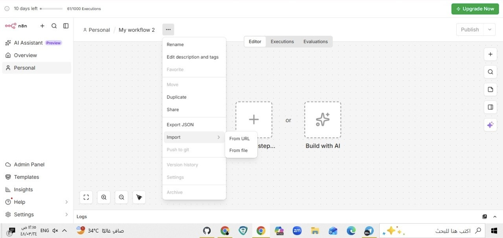

وظفني - تنبيهات الوظائف التلقائية
هذا مشروع بسيط يساعدك تستقبل التنبيهات عن الوظائف الجديدة في بريدك مباشرة.
الفكرة انه كل ربع ساعة الأتمتة تروح للموقع وتشتغل على الوظائف الجديدة وبعدين يوصلك بريد فيه تفاصيل الوظيفة.

على ماذا يحتوي؟

ملف n8n workflow جاهز للاستخدام
دليل شامل يشرح كل خطوة
ملف Read.me يختصر الخطوات

كيف تستخدمه

1. حمل/ي الملف jobs-workspace-26.json من هنا

2. ادخل/ي https://app.n8n.cloud وسجل/ي دخول

3. اضغط/ي Import واختار/ي الملف

4. بعدين مل/ي البيانات الحقيقية:
   البريد Gmail الخاص فيك
   رابط الموقع اللي فيه وظائف
   اختار/ي جدول البيانات من n8n

5. اختبر/ي الأتمتة بأول مرة

6. شغل/ي الأتمتة وبيشتغل تلقائيا

---

المتطلبات

حساب n8n - وهو مجاني
بريد Gmail
أي موقع فيه وظائف - أي موقع تختاره أو تختارينه
جدول بيانات في n8n

---

إيش تحتاج/ي تملأ

بعد الاستيراد فيه أماكن فارغة لازم تملأها بـ بيانات حقيقية

YOUR_EMAIL@gmail.com - ضع/ي أو حط/ي بريدك الحقيقي

YOUR_JOB_SITE_URL - ضع/ي أو حط/ي رابط موقع الوظائف

YOUR_TABLE_ID - هذا n8n بتساعد/ك تختار/ي أو تختاره من القائمة

---

الأمان

الملف على GitHub بدون أي بيانات شخصية.

أنت/ اللي بتحط/ي البيانات الحقيقية عند الاستيراد.

ما فيه كلمات مرور أو بيانات حساسة في الملف الأساسي.

---

الملفات

jobs-workspace-26.json - الأتمتة نفسها

README.md - الملف الحالي

IMPORT_GUIDE.md - شرح مفصل خطوة بخطوة

---

الخطوات اللي بتشتغل

الأتمتة تشتغل على 10 مراحل:

1. جدول زمني كل 15 دقيقة

2. طلب الموقع

3. استخراج الوظائف

4. جلب الوظائف المحفوظة

5. تصفية الوظائف الجديدة

6. جلب معلومات كل وظيفة

7. استخراج رابط التقديم

8. صياغة الرسالة

9. ارسال البريد

10. حفظ الوظائف الجديدة

---

النتائج

بريد لكل وظيفة جديدة توصلك فورا

توفير وقت - ما تحتاج/ي تفحص/ي الموقع بنفسك

تقديم أسرع قبل غيرك

تتبع الوظائف وحفظها

---

نصائح

استخدم/ي Chrome أو Firefox

اقرا/ي الدليل قبل البدء

جرب/ي على موقع واحد في الأول

بعدين وسع/ي على مواقع ثانية

---

في أي مشكلة

الدليل فيه أسئلة شائعة بتجاوب عليها.

لو في مشكلة في الاستيراد أو التشغيل، اقرا/ي الدليل مرة ثانية.

الأتمتة بتشتغل في الخلفية - ما تحتاج/ي تفتح/ي n8n كل مرة.
